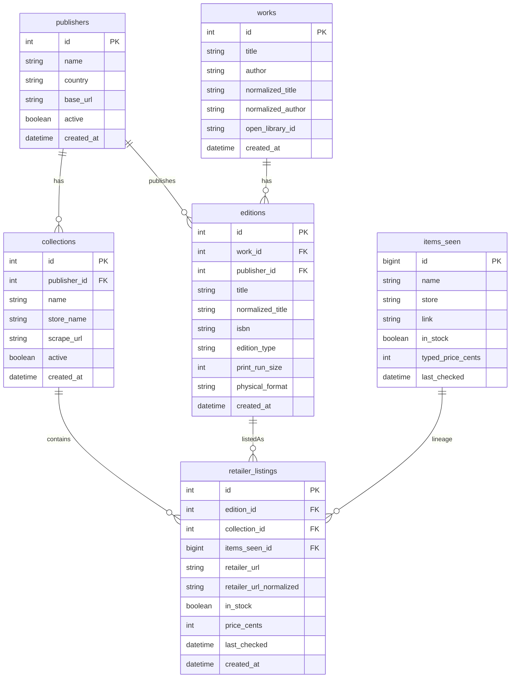

# Canonical Data Model ERD

This ERD documents the normalized catalog layer used to map raw scrape records to
stable entities for product features and analytics.



## Contract highlights

- `works` uniqueness: `(normalized_title, coalesce(normalized_author, ''))`
- `editions` uniqueness: `(work_id, publisher_id, normalized_title, coalesce(edition_type, ''))`
- `retailer_listings` uniqueness: `(collection_id, retailer_url_normalized)`
- `collections.store_name` is the compatibility bridge to existing preference logic

## Rendering fallback

Some markdown preview renderers (including certain IDE preview modes) do not execute
Mermaid blocks. Keep this Mermaid source as the canonical editable diagram and commit
a static export for universal visibility.

Recommended static artifact path:

- `docs/architecture/erd.png`

Optional markdown image embed once exported:

```md

```

